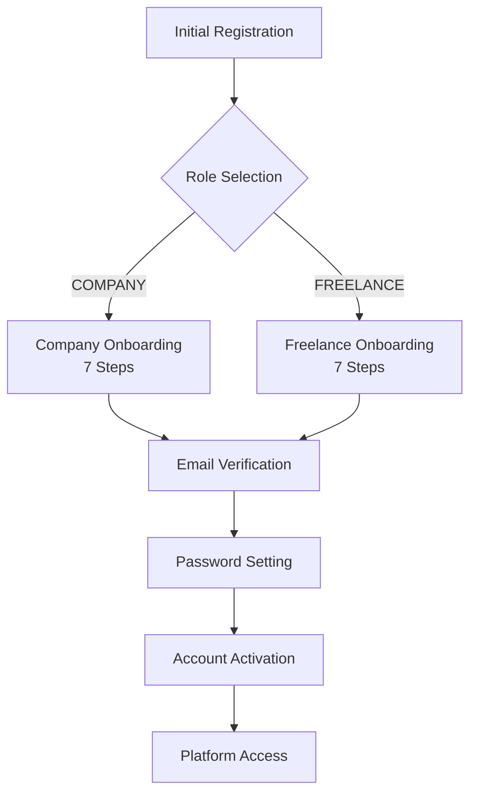
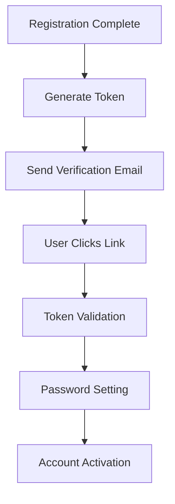

# Onboarding System Documentation

## Overview

The Lillinker platform implements a comprehensive dual-track onboarding system supporting both **Company** and **Freelance** user registration. The system uses a multi-step process with email verification, role-based onboarding, and platform service integration.

## Documentation Structure

This directory contains detailed documentation for all aspects of the onboarding system:

### 📚 Complete Documentation Files

1. **[Main Signup Overview](./signup.md)**

   - System architecture overview
   - Common components and security features
   - API endpoints summary
   - Cross-references to detailed documentation

2. **[Company Signup Documentation](./company-signup.md)**

   - Complete company registration flow (7 steps)
   - SIRET validation and company profiling
   - Portage company functionality
   - Company administrator setup
   - Platform services for companies
   - Company-specific database models and API endpoints

3. **[Freelance Signup Documentation](./freelance-signup.md)**

   - Complete freelance registration flow (7 steps)
   - Daily rate (TJM) management
   - Mission preferences and availability tracking
   - Portage candidate registration
   - Platform services for freelancers
   - Freelance-specific database models and API endpoints

4. **[Email Verification Documentation](./email-validation.md)**

   - Token-based email verification system
   - Password setting process
   - Security implementation details
   - Frontend and backend integration
   - Comprehensive error handling

5. **[This README](./README.md)**
   - Documentation summary and navigation
   - Quick reference guide
   - System overview and key concepts

### 🚀 Quick Start Guide

For developers new to the system:

1. **Start with**: [Main Signup Overview](./signup.md) for system architecture
2. **Then review**: [Email Verification](./email-validation.md) for shared authentication
3. **Focus on**: [Company Signup](./company-signup.md) OR [Freelance Signup](./freelance-signup.md) based on your needs
4. **Reference**: This README for quick lookups and summaries

## System Architecture Summary

### 🏗️ Core Components

- **AuthService**: Central authentication and registration service
- **Role-Based Flows**: Separate onboarding paths for COMPANY and FREELANCE users
- **Email Verification**: Crypto-secure token-based email validation system
- **Platform Services**: Dynamic service marketplace integration
- **Database Transactions**: Atomic operations ensuring data consistency

### 👥 User Types

```typescript
enum Role {
  ADMIN     // Platform administrators
  COMPANY   // Company administrators
  FREELANCE // Independent contractors
  MANAGER   // Company managers (future)
}
```

### 🔄 Registration Flow Overview



### 📋 Registration Phases

1. **Initial Registration**: Basic user information via `/api/auth/register`
2. **Role-Specific Onboarding**: Multi-step detailed profile completion
3. **Email Verification**: Token-based verification via `/api/auth/verify-email`
4. **Password Setting**: Secure password creation during verification
5. **Account Activation**: Full platform access

## Company Onboarding Summary

### 🏢 Company Registration Flow (7 Steps)

Detailed in: **[Company Signup Documentation](./company-signup.md)**

1. **General Information**: Company name, SIRET, description, portage status
2. **Consultants & Management**: Consultant count, management fee rates
3. **Supported Métiers**: Business domains and specializations
4. **Administrator Info**: Admin contact details and credentials
5. **Platform Services**: Service selection and custom service creation
6. **Summary Review**: Final validation before submission
7. **Success Confirmation**: Email verification instructions

### 🔑 Key Company Features

- **SIRET Validation**: French business registration number validation
- **Portage Company Support**: Specialized functionality for portage companies
- **Métier Management**: Business domain and specialization tracking
- **Service Marketplace**: Platform service selection and custom service creation
- **Administrator Setup**: Company admin account configuration

### 💾 Company Database Models

```typescript
interface CompanyFormData {
  companyName: string;
  siret: string;
  description: string;
  isPortage: 'yes' | 'no';
  selectedPortages: string[];
  consultantCount: string;
  managementFeeRate: string;
  selectedMetiers: string[];
  adminFirstName: string;
  adminLastName: string;
  adminEmail: string;
  adminPhone: string;
  selectedPlatformServices: string[];
  newServices: NewService[];
}
```

## Freelance Onboarding Summary

### 👨‍💻 Freelance Registration Flow (7 Steps)

Detailed in: **[Freelance Signup Documentation](./freelance-signup.md)**

1. **Personal Information**: Name, email, phone contact details
2. **Daily Rate (TJM)**: Taux Journalier Moyen (daily rate) setting
3. **Portage Interest**: Portage candidate status and preferences
4. **Mission Preferences**: Priority settings and preferred mission types
5. **Platform Services**: Service selection and custom service creation
6. **Mission Status**: Current availability and work status
7. **Summary Review**: Final validation and submission

### 🎯 Key Freelance Features

- **TJM Management**: Daily rate setting and validation
- **Mission Status Tracking**: Available, busy, or partially available
- **Priority Preferences**: Cost, quality, or speed focus
- **Portage Integration**: Connection with portage companies
- **Service Marketplace**: Platform service selection and custom offerings

### 💾 Freelance Database Models

```typescript
interface FreelanceFormData {
  firstName: string;
  lastName: string;
  email: string;
  phone: string;
  dailyRate: number;
  isPortageCandidate: boolean;
  selectedPortages: number[];
  preferredMissions: string[];
  selectedPlatformServices: number[];
  newServices: NewService[];
  currentMissionStatus: 'available' | 'busy' | 'partially_available';
  priority: 'cost' | 'quality' | 'speed';
}
```

## Email Verification Summary

### 📧 Email Verification System

Detailed in: **[Email Verification Documentation](./email-validation.md)**

#### 🔐 Security Features

- **Crypto-secure tokens**: 64-character hex tokens with 256-bit entropy
- **24-hour expiration**: Automatic token invalidation
- **Single-use tokens**: Cleared after successful verification
- **bcrypt password hashing**: 12 salt rounds for production security
- **Temporary passwords**: Secure placeholder during registration

#### 🔄 Verification Flow



#### 🛡️ API Endpoints

```typescript
// GET /api/auth/verify-email?token=abc123 (Redirect)
// POST /api/auth/verify-email (Verify & Set Password)
{
  "token": "64-character-hex-token",
  "password": "SecurePassword123!",
  "confirmPassword": "SecurePassword123!"
}
```

## API Reference Summary

### 🔌 Core Endpoints

#### Initial Registration

```typescript
POST /api/auth/register
{
  "first_name": "John",
  "last_name": "Doe",
  "email": "john@example.com",
  "role": "COMPANY", // or "FREELANCE"
  "phone_number": "+33123456789"
}
```

#### Company Onboarding

```typescript
POST /api/auth/onboarding/company
{
  "userId": "123456789",
  "company_name": "Tech Solutions SARL",
  "siret": "12345678901234",
  "consultant_count": 50,
  "management_fees": 8.5,
  "is_portage": true,
  "selected_services": [1, 2, 3],
  "selected_metiers": [1, 2],
  "new_services": [/* custom services */]
}
```

#### Freelance Onboarding

```typescript
POST /api/auth/onboarding/freelance
{
  "userId": "123456789",
  "daily_rate": 450.00,
  "is_portage_candidate": true,
  "selected_portages": [1, 2],
  "preferred_missions": ["développement web"],
  "current_mission_status": "available",
  "priority": "quality",
  "selected_services": [1, 3, 5]
}
```

#### Email Verification

```typescript
POST /api/auth/verify-email
{
  "token": "verification-token",
  "password": "SecurePassword123!",
  "confirmPassword": "SecurePassword123!"
}
```

## Database Schema Summary

### 💾 Core Models Overview

#### User Table

```sql
User {
  id: String (Primary Key)
  first_name: String
  last_name: String
  email: String (Unique)
  password: String -- Temporary → Real after verification
  role: Role (COMPANY | FREELANCE | ADMIN)
  status: Boolean -- Activated after verification
  email_verified: Boolean
  verification_token: String? -- 64-char hex, expires 24h
  created_at: DateTime
  updated_at: DateTime
}
```

#### Company & Freelance Models

```sql
Company {
  id: String (Primary Key)
  user_id: String (Foreign Key → User.id)
  company_name: String
  siret: String (Unique) -- French business ID
  consultant_count: Int
  management_fees: Float
  is_portage: Boolean
  // Relations to services, métiers, portages
}

Freelance {
  id: String (Primary Key)
  user_id: String (Foreign Key → User.id)
  daily_rate: Float -- TJM
  is_portage_candidate: Boolean
  preferred_missions: String[]
  current_mission_status: String
  priority: String
  // Relations to services, portages
}
```

### 🔗 Platform Services Architecture

```sql
PlatformService {
  id: Int (Primary Key)
  service_label: String
  data_type: DataType (TEXT | NUMBER | SELECT | RADIO)
  requires_data: Boolean
  choices: String[] -- For SELECT/RADIO
}

SelectedPlatformService {
  id: String (Primary Key)
  company_id: String? (FK → Company.id)
  freelance_id: String? (FK → Freelance.id)
  platform_service_id: Int (FK → PlatformService.id)
  response_data: Json -- User's service response
}
```

## Security Implementation Summary

### 🔒 Authentication Security

- **Password Security**: bcrypt hashing with 12 salt rounds
- **Token Security**: crypto.randomBytes(32) for 256-bit entropy
- **Session Management**: JWT tokens with secure expiration
- **Input Validation**: Comprehensive validation at API and database levels

### 🛡️ Data Protection

- **Database Transactions**: Atomic operations for data consistency
- **Unique Constraints**: Email and business ID uniqueness enforcement
- **Access Controls**: Role-based access and permission system
- **Audit Trails**: Comprehensive logging for security monitoring

## Testing Strategy Summary

### 🧪 Test Coverage

#### Unit Tests

- **AuthService methods**: Registration, verification, onboarding
- **API endpoints**: Company and freelance onboarding APIs
- **Validation logic**: Input validation and business rule testing
- **Security features**: Token generation, password handling

#### Integration Tests

- **Complete registration flows**: End-to-end company and freelance flows
- **Email verification workflows**: Token generation to account activation
- **Database transactions**: Data consistency and rollback testing
- **Error scenarios**: Comprehensive error handling validation

### 📊 Test Examples

```typescript
// Unit test example
describe('Company Onboarding API', () => {
  it('should create company with services', async () => {
    const response = await request(app).post('/api/auth/onboarding/company').send(validCompanyData);

    expect(response.status).toBe(200);
    expect(response.body.success).toBe(true);
  });
});

// Integration test example
describe('Full Registration Flow', () => {
  it('should complete company registration end-to-end', async () => {
    // Test: register → onboard → verify → activate
  });
});
```

## Error Handling Summary

### ⚠️ Common Error Scenarios

#### Registration Errors

```typescript
// Duplicate email
{
  "error": "Un utilisateur avec cette adresse e-mail existe déjà",
  "code": "EMAIL_EXISTS"
}

// Invalid role
{
  "error": "Le rôle spécifié n'est pas valide",
  "code": "INVALID_ROLE"
}
```

#### Company-Specific Errors

```typescript
// Duplicate SIRET
{
  "error": "Une société avec ce numéro SIRET existe déjà",
  "code": "SIRET_EXISTS"
}

// Invalid SIRET format
{
  "error": "Format SIRET invalide",
  "code": "INVALID_SIRET"
}
```

#### Verification Errors

```typescript
// Expired token
{
  "error": "Token de vérification invalide ou expiré",
  "code": "EXPIRED_TOKEN"
}

// Password mismatch
{
  "error": "Les mots de passe ne correspondent pas",
  "code": "PASSWORD_MISMATCH"
}
```

### 🔄 Error Recovery

- **Automatic rollback**: Database transactions ensure data consistency
- **Graceful degradation**: Partial success handling where appropriate
- **User guidance**: Clear error messages with recovery suggestions
- **Retry mechanisms**: Safe retry for transient errors

## Performance and Monitoring

### 📊 Key Metrics

- **Registration completion rate**: Users completing full onboarding flow
- **Email verification rate**: Successful email confirmations
- **Onboarding abandonment**: Drop-off points in the registration process
- **API response times**: Performance monitoring for all endpoints
- **Error rates**: Tracking and alerting for system issues

### 📈 Monitoring Implementation

```typescript
// Logging examples from detailed documentation
logger.info('Company onboarding completed', {
  userId: user.id,
  companyId: company.id,
  servicesSelected: data.selected_services?.length || 0,
  timestamp: new Date().toISOString(),
});

logger.warn('Email verification failed', {
  reason: 'expired_token',
  timestamp: new Date(),
  ip: request.ip,
});
```

## Best Practices and Guidelines

### 🏆 Development Best Practices

1. **Transaction Safety**: Always use database transactions for multi-table operations
2. **Input Validation**: Validate all inputs at API and business logic levels
3. **Error Handling**: Provide clear, actionable error messages
4. **Security First**: Implement crypto-secure tokens and proper password handling
5. **Testing Coverage**: Comprehensive unit and integration test suites

### 🚀 Performance Optimization

1. **Database Indexing**: Proper indexes on frequently queried fields
2. **Query Optimization**: Efficient database queries with proper joins
3. **Caching Strategy**: Strategic caching for platform services and static data
4. **Rate Limiting**: Prevent abuse with appropriate rate limiting
5. **Monitoring**: Comprehensive logging and performance tracking

### 👥 User Experience

1. **Progressive Disclosure**: Break complex forms into manageable steps
2. **Clear Progress**: Visual progress indicators throughout flows
3. **Save Progress**: Ability to save and resume onboarding
4. **Mobile Responsive**: Optimized for all device types
5. **Accessibility**: WCAG-compliant design and implementation

## Related Resources

### 📖 External Documentation

- **Prisma Documentation**: Database ORM and schema management
- **Next.js API Routes**: Server-side API implementation
- **React Hook Form**: Form state management patterns
- **bcrypt Documentation**: Password hashing best practices
- **Node.js Crypto**: Secure token generation techniques

### 🔧 Development Tools

- **Database Client**: Prisma Studio for database inspection
- **API Testing**: Postman/Insomnia for endpoint testing
- **Code Quality**: ESLint and Prettier configuration
- **Testing Framework**: Jest for unit and integration testing
- **Type Safety**: TypeScript for compile-time error checking

---

## Summary

This comprehensive onboarding system provides:

✅ **Dual-track registration** for companies and freelancers  
✅ **Secure email verification** with crypto-generated tokens  
✅ **Platform service integration** with custom service creation  
✅ **Database transaction safety** ensuring data consistency  
✅ **Comprehensive error handling** with clear user feedback  
✅ **Role-based access control** with proper authentication  
✅ **Extensive testing coverage** for reliability and security  
✅ **Performance monitoring** and operational insights

For detailed implementation guides, refer to the specific documentation files linked throughout this README.
