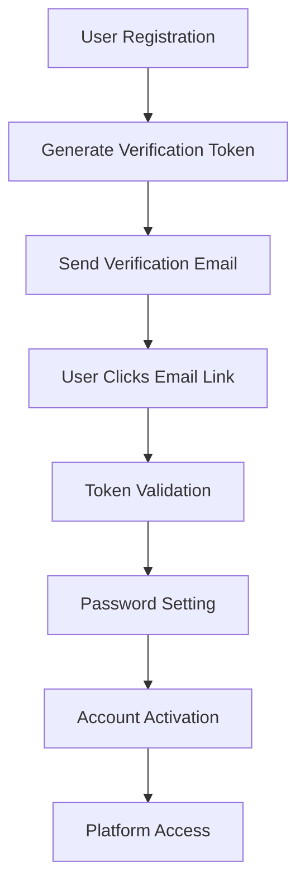
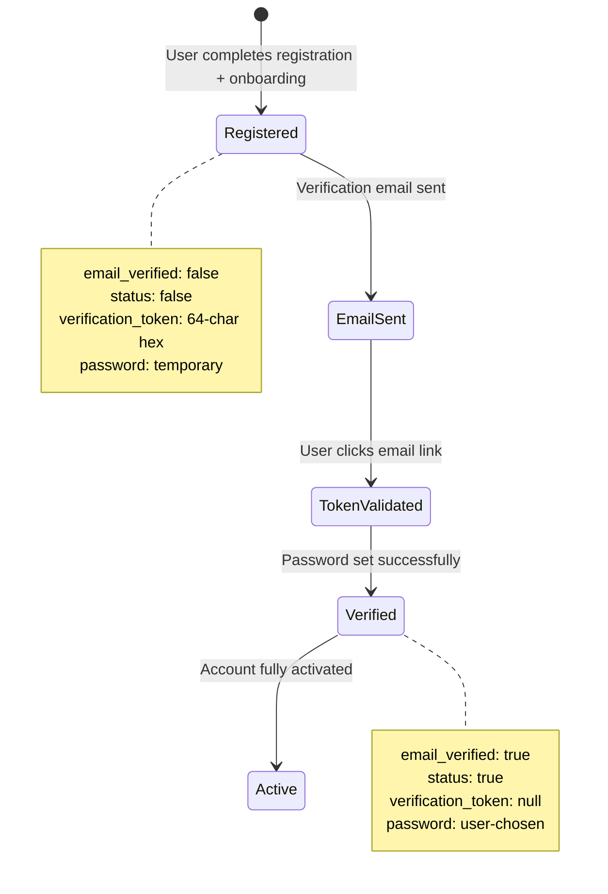

# Email Verification and Password Setting Documentation

## Overview

The Lillinker platform implements a secure email verification system using crypto-generated tokens, bcrypt password hashing, and a comprehensive verification flow. This system is shared between both Company and Freelance user registration flows and ensures email authenticity and account security before allowing users to access platform features.

**Related Documentation:**

- **[Company Signup](./company-signup.md)** - Company registration flow that uses this verification system
- **[Freelance Signup](./freelance-signup.md)** - Freelance registration flow that uses this verification system
- **[Main Signup Overview](./signup.md)** - Complete system architecture overview

## Email Verification Architecture

### Core Components

- **AuthService**: Handles registration, verification, and onboarding processes
- **Crypto Token Generation**: Uses Node.js `crypto.randomBytes()` for secure tokens
- **Prisma Database**: Manages user verification state and token storage
- **Email Service**: Sends verification emails via the mailer system

### System Flow Overview



## Complete Email Verification Flow

### Phase 1: Token Generation During Registration

The registration process creates a user with a temporary password and verification token. This applies to both Company and Freelance user registration:

```typescript
// AuthService.initiateRegistration() - Shared by Company and Freelance flows
static async initiateRegistration(data: InitialRegistration) {
  // 1. Validate email uniqueness
  const existingUser = await prisma.user.findUnique({
    where: { email: data.email },
  });

  if (existingUser) {
    throw new Error('Un utilisateur avec cette adresse e-mail existe déjà');
  }

  // 2. Generate secure verification token
  const verificationToken = randomBytes(32).toString('hex');
  const verificationTokenExpires = new Date(Date.now() + 24 * 60 * 60 * 1000); // 24 hours

  // 3. Create temporary password for security
  const tempPassword = await hash(randomBytes(32).toString('hex'), 12);

  // 4. Create user record
  const user = await prisma.user.create({
    data: {
      first_name: data.first_name,
      last_name: data.last_name,
      email: data.email,
      password: tempPassword, // Temporary - replaced during verification
      role: data.role, // COMPANY or FREELANCE
      phone_number: data.phone_number,
      email_verified: false,
      verification_token: verificationToken,
      verification_token_expires: verificationTokenExpires,
      status: false, // Activated after onboarding completion
    },
  });

  return { user, verificationToken };
}
```

**Initial User State After Registration:**

- `email_verified: false` - Email not yet verified
- `status: false` - Account not activated (activated after successful onboarding)
- `verification_token: string` - 64-character hex token
- `verification_token_expires: DateTime` - 24-hour expiration
- `password: string` - Temporary crypto-generated password

### Phase 2: Email Delivery

After successful registration and onboarding completion, the system sends a verification email:

```typescript
// AuthService.sendVerificationEmail() - Called after onboarding completion
static async sendVerificationEmail(userId: number) {
  const user = await prisma.user.findUnique({
    where: { id: userId },
    select: {
      email: true,
      first_name: true,
      last_name: true,
      verification_token: true,
      verification_token_expires: true,
    },
  });

  if (!user || !user.verification_token) {
    throw new Error('User not found or verification token missing');
  }

  // Send email with verification link
  const verificationLink = `${process.env.NEXT_PUBLIC_APP_URL}/auth/verify-email?token=${user.verification_token}`;

  await sendEmail({
    to: user.email,
    subject: 'Vérifiez votre adresse e-mail - Lillinker',
    template: 'email-verification',
    data: {
      firstName: user.first_name,
      lastName: user.last_name,
      verificationLink,
      expirationHours: 24,
    },
  });
}
```

#### Verification Email Content

```html
<!-- Email Template: email-verification -->
<h2>Vérification de votre adresse e-mail</h2>
<p>Bonjour {{firstName}} {{lastName}},</p>
<p>
  Merci de vous être inscrit sur Lillinker. Veuillez cliquer sur le lien ci-dessous pour vérifier
  votre adresse e-mail et définir votre mot de passe :
</p>
<a
  href="{{verificationLink}}"
  style="background-color: #007bff; color: white; padding: 10px 20px; text-decoration: none; border-radius: 5px;"
>
  Vérifier mon adresse e-mail
</a>
<p><strong>Important :</strong> Ce lien expire dans {{expirationHours}} heures.</p>
```

### Phase 3: Token Validation and Password Setting

#### Token Security Features

- **Crypto-secure generation**: Uses `crypto.randomBytes(32)` for 256-bit entropy
- **Hex encoding**: 64-character hexadecimal string
- **Expiration**: 24-hour validity window
- **Single-use**: Token cleared after successful verification

#### Verification Link Format

```
https://yourdomain.com/auth/verify-email?token=a1b2c3d4e5f6...64chars
```

#### API Endpoints

**1. GET Endpoint - Email Link Redirect**

```typescript
// GET /api/auth/verify-email?token=abc123
// Redirects to password setting page with token
export async function GET(request: NextRequest) {
  const { searchParams } = new URL(request.url);
  const token = searchParams.get('token');

  if (!token) {
    return NextResponse.redirect('/auth/error?message=missing-token');
  }

  // Redirect to password setting page
  return NextResponse.redirect(`/auth/set-password?token=${token}`);
}
```

**2. POST Endpoint - Verify Email and Set Password**

```typescript
// POST /api/auth/verify-email
// Verifies token and sets user password
export async function POST(request: NextRequest) {
  try {
    const { token, password, confirmPassword } = await request.json();

    // Validate request data
    if (!token || !password || !confirmPassword) {
      return NextResponse.json({ error: 'Token et mots de passe requis' }, { status: 400 });
    }

    if (password !== confirmPassword) {
      return NextResponse.json(
        { error: 'Les mots de passe ne correspondent pas' },
        { status: 400 }
      );
    }

    // Verify email and set password
    const result = await AuthService.verifyEmailAndSetPassword(token, password);

    return NextResponse.json(result);
  } catch (error) {
    return NextResponse.json({ error: error.message }, { status: 400 });
  }
}
```

### Phase 4: Verification and Password Update

Users verify their email and set their actual password:

```typescript
// AuthService.verifyEmailAndSetPassword()
static async verifyEmailAndSetPassword(token: string, password: string) {
  // 1. Find user with valid token
  const user = await prisma.user.findFirst({
    where: {
      verification_token: token,
      verification_token_expires: {
        gt: new Date(), // Token not expired
      },
      email_verified: false, // Not already verified
    },
  });

  if (!user) {
    throw new Error('Token de vérification invalide ou expiré');
  }

  // 2. Validate password strength (optional - can be done on frontend)
  if (password.length < 8) {
    throw new Error('Le mot de passe doit contenir au moins 8 caractères');
  }

  // 3. Hash the real password
  const hashedPassword = await hash(password, 12);

  // 4. Update user with verified status
  const updatedUser = await prisma.user.update({
    where: { id: user.id },
    data: {
      password: hashedPassword, // Replace temporary password
      email_verified: true,
      verification_token: null, // Clear token
      verification_token_expires: null,
      status: true, // Activate account
    },
  });

  return {
    success: true,
    message: 'Email vérifié et mot de passe défini avec succès',
    user: {
      id: updatedUser.id,
      email: updatedUser.email,
      first_name: updatedUser.first_name,
      last_name: updatedUser.last_name,
      role: updatedUser.role,
      email_verified: updatedUser.email_verified,
      status: updatedUser.status,
    }
  };
}
```

## Frontend Implementation

### Password Setting Page (`/auth/set-password`)

```typescript
// pages/auth/set-password.tsx
import { useState, useEffect } from 'react';
import { useRouter } from 'next/router';

export default function SetPasswordPage() {
  const router = useRouter();
  const { token } = router.query;
  const [password, setPassword] = useState('');
  const [confirmPassword, setConfirmPassword] = useState('');
  const [isLoading, setIsLoading] = useState(false);
  const [error, setError] = useState('');

  const handleSubmit = async (e: React.FormEvent) => {
    e.preventDefault();
    setIsLoading(true);
    setError('');

    try {
      const response = await fetch('/api/auth/verify-email', {
        method: 'POST',
        headers: { 'Content-Type': 'application/json' },
        body: JSON.stringify({ token, password, confirmPassword }),
      });

      const data = await response.json();

      if (response.ok) {
        // Redirect to success page or login
        router.push('/auth/login?verified=true');
      } else {
        setError(data.error || 'Une erreur est survenue');
      }
    } catch (error) {
      setError('Erreur de connexion');
    } finally {
      setIsLoading(false);
    }
  };

  return (
    <div className="min-h-screen flex items-center justify-center">
      <div className="max-w-md w-full space-y-8">
        <div>
          <h2 className="text-3xl font-bold text-center">
            Définir votre mot de passe
          </h2>
          <p className="mt-2 text-center text-gray-600">
            Veuillez créer un mot de passe sécurisé pour votre compte
          </p>
        </div>

        <form onSubmit={handleSubmit} className="space-y-6">
          <div>
            <label htmlFor="password" className="block text-sm font-medium">
              Mot de passe
            </label>
            <input
              id="password"
              type="password"
              value={password}
              onChange={(e) => setPassword(e.target.value)}
              required
              minLength={8}
              className="mt-1 block w-full px-3 py-2 border border-gray-300 rounded-md"
            />
          </div>

          <div>
            <label htmlFor="confirmPassword" className="block text-sm font-medium">
              Confirmer le mot de passe
            </label>
            <input
              id="confirmPassword"
              type="password"
              value={confirmPassword}
              onChange={(e) => setConfirmPassword(e.target.value)}
              required
              minLength={8}
              className="mt-1 block w-full px-3 py-2 border border-gray-300 rounded-md"
            />
          </div>

          {error && (
            <div className="text-red-600 text-sm">{error}</div>
          )}

          <button
            type="submit"
            disabled={isLoading}
            className="w-full py-2 px-4 bg-blue-600 text-white rounded-md hover:bg-blue-700 disabled:opacity-50"
          >
            {isLoading ? 'Vérification...' : 'Définir le mot de passe'}
          </button>
        </form>
      </div>
    </div>
  );
}
```

## Database Models

### User Table Schema

```sql
User {
  id: String (Primary Key)
  first_name: String
  last_name: String
  email: String (Unique)
  password: String -- Temporary during registration, real after verification
  role: Role (COMPANY | FREELANCE | ADMIN)
  phone_number: String?
  status: Boolean (Default: false) -- Activated after verification
  email_verified: Boolean (Default: false)
  verification_token: String? (Unique) -- 64-character hex token
  verification_token_expires: DateTime? -- 24-hour expiration
  created_at: DateTime (Default: now())
  updated_at: DateTime (Updated on change)

  // Relations
  company: Company?
  freelance: Freelance?
}
```

### User State Transitions



## Integration with Registration Flows

### Company Registration Integration

```typescript
// After company onboarding completion
const result = await prisma.$transaction(async () => {
  // 1. Create company profile
  const company = await CompanyService.createCompany(userId, companyData);

  // 2. Link services and métiers
  await CompanyService.linkPlatformServices(company.id, serviceIds);
  await CompanyService.linkMetiers(company.id, metierIds);

  return { company };
});

// 3. Send verification email (outside transaction)
await AuthService.sendVerificationEmail(parseInt(userId));
```

### Freelance Registration Integration

```typescript
// After freelance onboarding completion
const result = await prisma.$transaction(async () => {
  // 1. Create freelance profile
  const freelance = await FreelanceService.createFreelanceProfile(userId, freelanceData);

  // 2. Link services and portages
  await FreelanceService.linkPlatformServices(freelance.id, serviceIds);
  await FreelanceService.linkPortages(freelance.id, portageIds);

  return { freelance };
});

// 3. Send verification email (outside transaction)
await AuthService.sendVerificationEmail(parseInt(userId));
```

## Security Implementation

### Token Security

- **Crypto-secure tokens**: `crypto.randomBytes(32).toString('hex')` generates 256-bit entropy
- **24-hour expiration**: Automatic token invalidation after 24 hours
- **Single-use tokens**: Cleared immediately after successful verification
- **Unique constraint**: Database ensures no token duplication

### Password Security

- **Temporary passwords**: Initial crypto-generated secure placeholder until verification
- **bcrypt hashing**: 12 salt rounds for production-level security
- **Password validation**: Minimum 8 characters (configurable)
- **Secure replacement**: Temporary password completely replaced during verification

### Database Security

- **Transaction integrity**: Atomic operations ensure data consistency
- **Constraint validation**: Unique email and token enforcement
- **Status controls**: Multi-level activation flags (email_verified + status)

## Error Handling

### API Error Responses

The verification endpoints handle comprehensive error scenarios:

#### 1. Missing or Invalid Token

```typescript
// GET /api/auth/verify-email (missing token)
{
  "error": "Token de vérification manquant",
  "code": "MISSING_TOKEN"
}

// POST /api/auth/verify-email (invalid token)
{
  "error": "Token de vérification invalide ou expiré",
  "code": "INVALID_TOKEN"
}
```

#### 2. Expired Token

```typescript
{
  "error": "Token de vérification expiré",
  "code": "EXPIRED_TOKEN",
  "message": "Veuillez demander un nouveau lien de vérification"
}
```

#### 3. Already Verified

```typescript
{
  "error": "Email déjà vérifié",
  "code": "ALREADY_VERIFIED",
  "message": "Votre compte est déjà activé"
}
```

#### 4. Password Validation Errors

```typescript
{
  "error": "Le mot de passe doit contenir au moins 8 caractères",
  "code": "WEAK_PASSWORD"
}

{
  "error": "Les mots de passe ne correspondent pas",
  "code": "PASSWORD_MISMATCH"
}
```

### Frontend Error Handling

```typescript
// Error handling in password setting component
const handleVerificationError = (error: any) => {
  switch (error.code) {
    case 'INVALID_TOKEN':
    case 'EXPIRED_TOKEN':
      router.push('/auth/error?type=expired-token');
      break;
    case 'ALREADY_VERIFIED':
      router.push('/auth/login?message=already-verified');
      break;
    case 'WEAK_PASSWORD':
    case 'PASSWORD_MISMATCH':
      setFieldError(error.message);
      break;
    default:
      setGeneralError('Une erreur inattendue est survenue');
  }
};
```

## Testing Strategy

### Unit Tests for Email Verification

```typescript
// tests/unit/api/auth/verify-email.test.ts
describe('Email Verification API', () => {
  describe('POST /api/auth/verify-email', () => {
    it('should successfully verify email and set password', async () => {
      // Setup user with valid token
      const user = await createTestUser({
        email_verified: false,
        verification_token: 'valid-token',
        verification_token_expires: futureDate,
      });

      const response = await request(app).post('/api/auth/verify-email').send({
        token: 'valid-token',
        password: 'SecurePassword123!',
        confirmPassword: 'SecurePassword123!',
      });

      expect(response.status).toBe(200);
      expect(response.body.success).toBe(true);

      // Verify user state updated
      const updatedUser = await prisma.user.findUnique({
        where: { id: user.id },
      });
      expect(updatedUser.email_verified).toBe(true);
      expect(updatedUser.verification_token).toBeNull();
      expect(updatedUser.status).toBe(true);
    });

    it('should reject expired tokens', async () => {
      const user = await createTestUser({
        email_verified: false,
        verification_token: 'expired-token',
        verification_token_expires: pastDate,
      });

      const response = await request(app).post('/api/auth/verify-email').send({
        token: 'expired-token',
        password: 'SecurePassword123!',
        confirmPassword: 'SecurePassword123!',
      });

      expect(response.status).toBe(400);
      expect(response.body.code).toBe('EXPIRED_TOKEN');
    });

    it('should validate password confirmation', async () => {
      const user = await createTestUser({
        email_verified: false,
        verification_token: 'valid-token',
        verification_token_expires: futureDate,
      });

      const response = await request(app).post('/api/auth/verify-email').send({
        token: 'valid-token',
        password: 'Password123!',
        confirmPassword: 'DifferentPassword!',
      });

      expect(response.status).toBe(400);
      expect(response.body.code).toBe('PASSWORD_MISMATCH');
    });
  });
});
```

## User Experience Flow

### Complete User Journey

1. **Registration**: User completes company/freelance onboarding
2. **Email Sent**: System sends verification email with secure link
3. **Email Click**: User clicks verification link in email
4. **Redirect**: Browser redirects to password setting page with token
5. **Password Creation**: User creates and confirms their password
6. **Verification**: System validates token and updates user account
7. **Activation**: Account becomes fully active and accessible
8. **Login**: User can now log in with email and password

### Success States

After successful verification, users see:

- **Confirmation message**: "Email vérifié avec succès"
- **Account status**: Full platform access
- **Login capability**: Can authenticate with email/password
- **Profile completion**: Company/Freelance profile is active

## Monitoring and Logging

### Verification Events

```typescript
// Log verification attempts
logger.info('Email verification attempted', {
  token: token.substring(0, 8) + '...', // Partial token for security
  timestamp: new Date(),
  userAgent: request.headers['user-agent'],
});

// Log successful verifications
logger.info('Email verification successful', {
  userId: user.id,
  email: user.email,
  role: user.role,
  timestamp: new Date(),
});

// Log verification failures
logger.warn('Email verification failed', {
  reason: 'expired_token',
  timestamp: new Date(),
  ip: request.ip,
});
```

### Metrics to Track

- **Verification success rate**: Percentage of successful verifications
- **Token expiration rate**: How many tokens expire unused
- **Time to verification**: Average time between email send and verification
- **Failed verification attempts**: Security monitoring for suspicious activity

## Summary

The email verification system provides a secure, user-friendly way to:

- **Validate email ownership**: Ensures users control their registered email
- **Secure account activation**: Prevents unauthorized account access
- **Password setting**: Allows users to choose their own secure passwords
- **Integration with onboarding**: Seamlessly works with both company and freelance flows
- **Comprehensive error handling**: Provides clear feedback for all scenarios
- **Security best practices**: Implements industry-standard token and password security

This system ensures that all Lillinker users have verified, secure accounts before accessing platform features.
