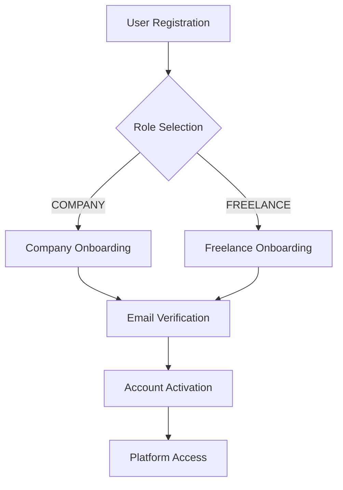

# User Registration and Onboarding Documentation

## Overview

The Lillinker platform implements a comprehensive onboarding system that handles both Company and Freelance user registration through a multi-step, multi-phase approach with email verification, role-based onboarding flows, and platform service integration.

**Note**: This documentation has been split into role-specific files for better readability:

- **[Company Signup Documentation](./company-signup.md)** - Complete guide for company registration and onboarding
- **[Freelance Signup Documentation](./freelance-signup.md)** - Complete guide for freelance registration and onboarding

## Quick Reference

### Documentation Structure

For detailed implementation guides, please refer to the specific documentation:

1. **[Company Signup](./company-signup.md)**

   - Company-specific onboarding flow (7 steps)
   - SIRET validation and company profiling
   - Portage company functionality
   - Company administrator setup
   - Platform services for companies

2. **[Freelance Signup](./freelance-signup.md)**
   - Freelance-specific onboarding flow (7 steps)
   - Daily rate (TJM) management
   - Mission preferences and availability
   - Portage candidate registration
   - Platform services for freelancers

### Common Architecture Components

Both company and freelance onboarding share common infrastructure:

#### Authentication System

- **Initial Registration**: Basic user information via `/api/auth/register`
- **Email Verification**: Token-based verification via `/api/auth/verify-email`
- **Password Setting**: Secure password creation during verification

#### Database Models

- **User Table**: Common user data (name, email, role, verification status)
- **EmailVerificationToken**: Secure token management
- **PlatformService**: Flexible service architecture
- **Portage**: Portage company integration

#### Security Features

- **Crypto-secure tokens**: 64-character hex tokens with 24h expiration
- **Bcrypt password hashing**: 12 salt rounds for production security
- **Database transactions**: Atomic operations for data integrity

#### Testing Strategy

- **Unit Tests**: API endpoint testing with comprehensive mocking

### Registration Flow Overview



### API Endpoints Summary

#### Common Endpoints

```typescript
POST / api / auth / register; // Initial registration
GET / api / auth / verify - email; // Email verification redirect
POST / api / auth / verify - email; // Set password & verify
```

#### Role-Specific Endpoints

```typescript
POST / api / auth / onboarding / company; // Company onboarding
POST / api / auth / onboarding / freelance; // Freelance onboarding
```

### Error Handling

Common error scenarios across both flows:

- **Duplicate email registration**
- **Invalid or expired verification tokens**
- **Onboarding before initial registration**
- **Platform service validation errors**

### File Structure Reference

```
docs/onboarding/
├── signup.md              # This overview file
├── company-signup.md       # Detailed company documentation
├── freelance-signup.md     # Detailed freelance documentation
└── README.md              # General onboarding information
```

For complete implementation details, testing strategies, and technical specifications, please refer to the role-specific documentation files linked above.
